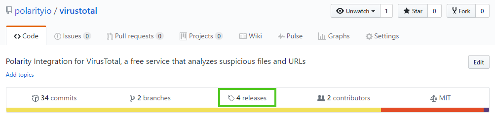

---
# You don't need to edit this file, it's empty on purpose.
# Edit theme's home layout instead if you wanna make some changes
# See: https://jekyllrb.com/docs/themes/#overriding-theme-defaults
layout: default
---

## Polarity Integrations

The Polarity Integration Framework provides a way to connect data sources to Polarity so that real-time notifications can be pushed to Polarity users based on data that is important to you.
    
In addition to connecting to existing datasources, the integration framework allows you customize how that data is displayed in the notification window.

## Installing Integrations

All Polarity Integrations are installed in a similar manner.  You can install integrations by either downloading a tar archive from the GitHub releases page of the integration you are interested in, or by using [Git](https://git-scm.com/) to clone the repo to your server.

In the instructions below we have provided example commands which will need to be modified depending on which integration you are installing.  The following variables will need to be modified when you run the example commands:

* **${integration_version}** : The version of the integration you are trying to install (e.g., "1.0.1-beta", "0.0.1", "2.0.0", etc.)
* **${integration_name}**: The name of the integration you are trying to install.  For example, "virustotal", "google-maps", "crits", etc.  Note that the name of the integration will match the name of the repository in GitHub.

> We recommend installing integrations using Git as the process requires less steps.  Git should already be installed on your Polarity Server.

### Installing Integrations via Git Clone

Navigate to the integrations folder on your Polarity Server:

```bash
cd /app/polarity-server/integrations
```
Generally, you will want to clone the latest release of the integration using the following command:

```bash
git clone https://github.com/polarityio/${integration_name}.git 
```

For example, to clone the latest VirusTotal integration you would use the following command:

```bash
git clone https://github.com/polarityio/virustotal.git
```

If you are looking to install a specific version you can do that as well:

```bash
git clone --branch ${integration_version} https://github.com/polarityio/${integration_name}.git 
```

As an example, if you wanted to install version `1.0.2-beta` of the `virustotal` integration you would use the commands:

```bash
cd /app/polarity-server/integrations
git clone --branch 1.0.2-beta https://github.com/polarityio/virustotal.git 
```

Once the repo has been cloned onto your server, change into the integration directory:

```bash
cd ${integration-name}
```

Use `npm` to install the integration's dependencies

```bash
npm install
```

Ensure the integration directory is owned by the `polarityd` user

```bash
chown -R polarityd:polarityd /app/polarity-server/integrations
```

Restart your Polarity-Server

```bash
service polarityd restart
```

The integration is now installed and you can use the Integrations page in Polarity-Web to configure integration specific options.  Please see the README.md file of the installed integration for details about integration specific options.  

### Installing Integrations via Release Download
 
Navigate to the releases page for the integration you are installing.  The URL should look like `https://github.com/polarityio/${integration_name}/releases`.  For example, the releases page for the virustotal integration is [https://github.com/polarityio/virustotal/releases](https://github.com/polarityio/virustotal/releases).  You can find a link to the releases page near the top of the integration's GitHub repository.



Download the `tar.gz` file for the version of the integration you want to install (we typically recommend installing the latest version of the integration). 


Once downloaded, upload the `tar.gz` file to the Polarity Server's integrations directory (`/app/polarity-server/integrations`).

If you have `wget` or `curl` installed on your Polarity Server you can use the following commands to download the integration to your Polarity Server:

For `wget`, run the following command:

```shell
wget --directory-prefix=/app/polarity-server/integrations https://github.com/polarityio/${integration_name}/archive/${integration_version}.tar.gz
```

For `curl`, run the following commands:

```bash
cd /app/polarity-server/integrations
curl -O https://github.com/polarityio/${integration_name}/archive/${integration_version}.tar.gz
```

> Note that if you use wget or curl to download the integration, the downloaded file will not include the name of the integration.  For example, if you were downloading version 1.0.2-beta of the virustotal integration, the downloaded filename will be 1.0.2-beta.tar.gz (without any reference to virustotal).  

Once you have downloaded/uploaded the integration to your Polarity Server you will need to untar it.  First, ensure you are in the integrations directory:

```bash
cd /app/polarity-server/integrations
```
  
Then, extract the tar file:

```bash
tar -xzvf <filename>
```

Note that after extraction the name of the directory containing the integration will include the version number.  For example, if you download version `1.0.2-beta` of the virustotal integration then you will have the following directory:

```shell
/app/polarity-server/integrations/virustotal-1.0.2-beta
```

We recommend renaming the integration directory to just include the name of the integration.  As an example, if you downloaded the virustotal integration you would rename the directory to `virustotal` instead of `virustotal-${integration_version}`.  

```bash
mv virustotal-1.0.2-beta virustotal
```

Navigate into the extracted folder for the new integration:

```bash
cd ${integration_name}
```

Install the integration's dependencies:

```bash
npm install
```

Ensure the integration directory is owned by the `polarityd` user
 
```bash
chown -R polarityd:polarityd /app/polarity-server/integrations/${integration_name}
```

Restart your Polarity-Server so the new integration can be loaded.

```bash
service polarityd restart
```

The integration is now installed and you can use the Integrations page in Polarity-Web to configure integration specific options.  Please see the README.md file of the installed integration for details about integration specific options.  

## Polarity

Polarity is a memory-augmentation platform that improves and accelerates analyst decision-making.  For more information about the Polarity platform please see: 

[https://polarity.io/](https://polarity.io) 
